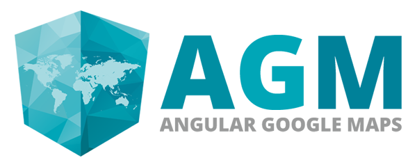

[](https://angular-maps.com/)

# AGM - Angular Google Maps

Modified version of AGM - Basically 1.1.0 with the custom IconURL (symbol support) commit added. Handy for anyone who doesn't want to open the can of worms inside 3.0.0-beta-0 (highly recommend you don't)

I've also added Angular 14 support, I've tested on a production project (in staging) and it works fine. Any problems, let me know.

---

## Packages

This project is a mono repo and hosts multiple packages:

| Package                  | Downloads                                                                                                                                         |
| ------------------------ | ------------------------------------------------------------------------------------------------------------------------------------------------- |
| @lvmaps/core                | [](https://www.npmjs.com/package/@lvmaps/core)                                              |
| @lvmaps/snazzy-info-window  | [](https://www.npmjs.com/package/@lvmaps/snazzy-info-window)    |
| @lvmaps/js-marker-clusterer | [](https://www.npmjs.com/package/@lvmaps/js-marker-clusterer) |
| @lvmaps/drawing | [](https://www.npmjs.com/package/@lvmaps/drawing) |

---

## Playing with AGM (Angular Google Maps)

If you just want to play with AGM and don't want to set up a full project, you can use the following Plunker. It has all the dependencies to play with Angular, Typescript and of course `AGM`:

[&raquo; Play with Angular Google Maps on Stackblitz](https://stackblitz.com/edit/angular-google-maps-demo)

## Installation

`LVMAPS` gets shipped via the Node Package Manager. So make sure that you have [NodeJS](https://nodejs.org) installed.
You can install the package with the following command:

```shell
npm install @lvmaps/core

## IF YOU NEED DRAWING TOOLS
npm install @lvmaps/drawing
```

Everything is exactly the same as the main AGM v1.1.0 plugin, follow the docs for more info.

You should also checkout the [Getting started](https://angular-maps.com/guides/getting-started/) guide for further information.
